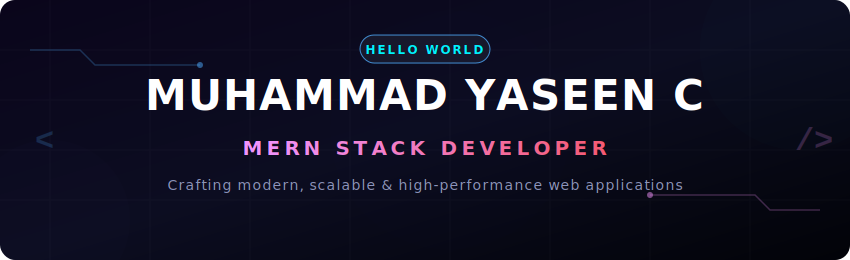

  

  

---

### 💻 Profile

I am a Full Stack Developer specializing in the MERN stack, Next.js, and TypeScript. I design, build, and maintain production-ready web applications, with a focus on robust REST API architectures, secure authentication systems, AI integrations, and performance optimization.

---

### 💼 Experience

**MERN Stack Developer Intern** | OneTeam Solutions, Kochi  
*Jul 2025 – Jan 2026*
- Developed and maintained responsive full-stack features using React.js, Node.js, and Express.js.
- Built and integrated secure, scalable REST APIs.
- Collaborated on feature development within Agile team environments utilizing Git-based workflows.

**Freelance Web Developer**  
*May 2026 – Present*
- Build real-world client projects using Next.js, React, and TypeScript.
- Implement search engine optimization (SEO), page speed optimization, and responsive design patterns.
- Manage full-cycle application deployment, hosting setup, maintenance, and client collaboration.

---

### 🛠️ Tech Stack

| Category | Technologies |
| :--- | :--- |
| **Frontend Development** |         |
| **Backend Development** |   |
| **Databases** |    |
| **Tools & Platforms** |       |

---

### 🚀 What I Build

- ✔ **Full Stack Web Applications** (MERN, Next.js, TypeScript)
- ✔ **REST API Architecture** (Node.js, Express, scalability-focused design)
- ✔ **Authentication & Authorization Systems** (JWT, Firebase OAuth, multi-role access control)
- ✔ **AI-Powered Features** (OpenAI, Gemini API integrations)
- ✔ **E-Commerce Platforms** (Payment gateways, cart management, vendor features)
- ✔ **SaaS Applications** (Interactive dashboards, state management)
- ✔ **Business Websites** (SEO-optimized, modern aesthetic, high conversion)
- ✔ **Interactive 3D Experiences** (Three.js, WebGL integration)

---

### 🌟 Featured Projects

#### 🛒 [SwiftCart — AI-Powered E-Commerce Platform](https://github.com/YASEEEN2005/AI-Powered-E-Commerce-Website)
*AI-driven, multi-role (User/Seller/Admin) shopping platform with secure payments.*
- **Core Stack:** MongoDB, Express.js, React, Node.js
- **Key Integrations:** Google Gemini AI (product recommendations), Razorpay payment gateway, Cloudinary (media uploads)
- **Security:** JWT Authentication and Firebase OAuth
- [🔗 Live Demo](https://ai-powered-e-commerce-website-sable.vercel.app) | [💻 Source Code](https://github.com/YASEEEN2005/AI-Powered-E-Commerce-Website)

#### 🌴 [Vanyaa Rainforest Retreat — Interactive 3D Resort Experience](https://github.com/YASEEEN2005/Resort)
*Immersive luxury resort web experience utilizing modern WebGL technologies.*
- **Core Stack:** React.js, Three.js, React Three Fiber, Framer Motion
- **Key Focus:** 3D rendering optimization, fluid interactive transitions, and responsive layouts
- [🔗 Live Demo](https://resort-ashy.vercel.app) | [💻 Source Code](https://github.com/YASEEEN2005/Resort)

#### 📊 [The Gallery — Personal Productivity Dashboard](https://github.com/YASEEEN2005/Personal-Dashboard)
*A sleek bento-grid productivity panel for aggregating widgets and external APIs.*
- **Core Stack:** React, Redux Toolkit, Tailwind CSS
- **Key Integrations:** OpenWeather API, Wikipedia API, custom responsive bento widgets
- [🔗 Live Demo](https://personal-dashboard-ten-gules.vercel.app) | [💻 Source Code](https://github.com/YASEEEN2005/Personal-Dashboard)

---

### 📊 GitHub Analytics

  
  

  

---

### 📫 Connect With Me

- **🌐 Portfolio:** [muhammadyaseen.online](https://www.muhammadyaseen.online)
- **💼 LinkedIn:** [linkedin.com/in/yaseen-dev](https://www.linkedin.com/in/yaseen-dev)
- **📧 Email:** [muhammadyaseen50943@gmail.com](mailto:muhammadyaseen50943@gmail.com)
- **💻 GitHub:** [github.com/YASEEEN2005](https://github.com/YASEEEN2005)

---

  

